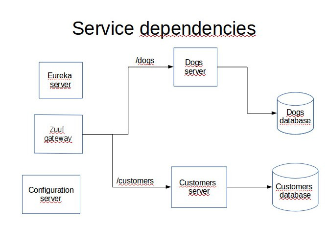

# peridot-gateway
I present here a microservice-oriented application demo that uses Spring Session with Redis implementation. It also uses Zuul as a gateway. 

Here are the prerequisites for running the complete application:

Any Linux platform (I use Ubuntu 16.04)

MySQL server installed

A recent Redis version installed (I used 3.0.6)

A recent Apache Maven version installed (I used 3.3.9)

In addition I used Spring Tool Suite for developing this demo but it is not required for running the application.

The complete application is comprised of 2 user interfaces with different access rights and a single gateway. The two UI and the gateway share the same Redis backed Spring Session. 

The UI are customers-frontend on port 8080 and dogs-frontend on port 8081. The gateway itself runs on port 5555.

A separate Eureka server is used to register both services customers-service and users-services.

A separate Spring Cloud configuration server sets all deployment properties for the two UI and the gateway that all have spring-cloud-config-client dependency. It fetches properties from the local file system. All configuration YAML files are stored in the subdirectory peridot-config-repo.

The dependencies are summarized on this figure:



Here are the steps to run the application.

## 1. Database creation

In MySQL client run the commands:
```
SOURCE peridotCustomer.sql
SOURCE peridotDogs.sql
```

This creates two databases named peridot\_customers and peridot\_dogs.

## 2. JAR files creation

In each project directory:
1. confsvr
1. eureka-service
1. customers-server
1. dogs-server
1. peridot-gateway

run the Maven command:
```
./mvnw clean package
```

Then 
## 3. Launching the application

In each project directory (following the sequence)
1. confsvr
1. eureka-service
1. customers-server
1. dogs-server
1. peridot-gateway

run the Maven command:
```
./mvnw spring-boot:run
```

Now you can login to the site on port 5555. Once logged the user can access the sites /customers and /dogs depending on their granted authorities. For the sake of simplicity I have created 6 different in-memory users with different roles:

User      | Password | Roles
--------- | -------- | ----------------------------------------
Carol     | sator    | CUSTOMER_USER
Alice     | arepo    | CUSTOMER_USER, CREATE, UPDATE
Richard   | rotas    | CUSTOMER_USER, CREATE, UPDATE, DELETE
Marissa   | wombat   | DOG_USER
Steve     | apple    | DOG_USER, CREATE, UPDATE
Bill      | orange   | DOG_USER, CREATE, UPDATE, DELETE

Of course to execute a CRUD request you need to be granted the required authority. For example to be allowed to create a new customer you have to login as Alice or Richard etc. Moreover only Carol, Alice and Richard can access /customlers and only Marissa, Steve and Bill can access /dogs.

Note that the only port exposed to the user is 5555.


